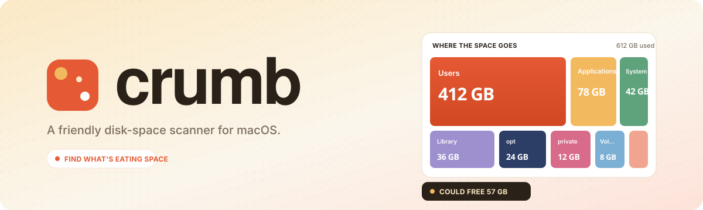
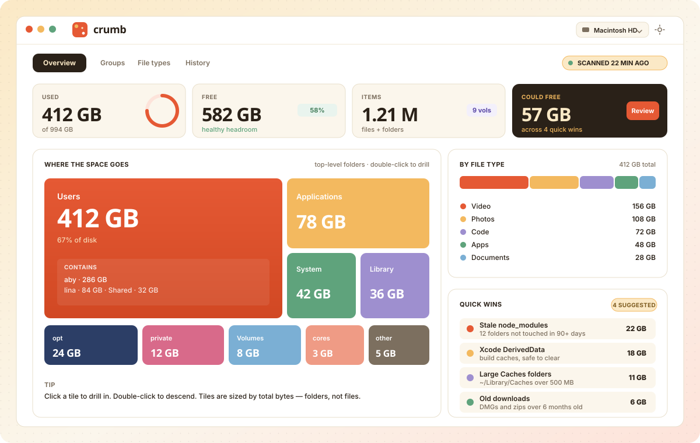
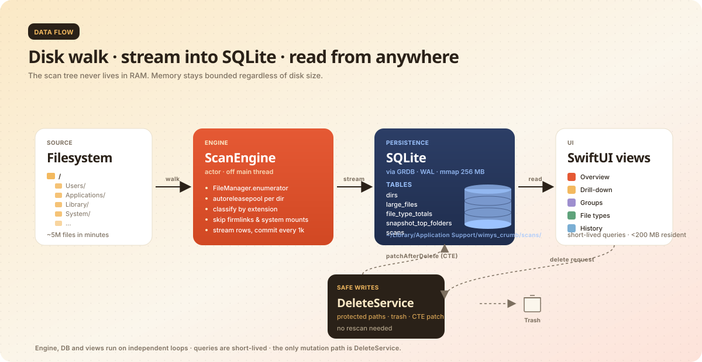

<p align="center">
  
</p>

<p align="center">
  
  
  
  
  
</p>

<p align="center">
  A friendly disk-space scanner for macOS —<br>
  it finds where your space went, groups similar things across the whole drive,
  and lets you delete the reclaimable bits safely.
</p>

<p align="center">
  <a href="#features">Features</a> &nbsp;·&nbsp;
  <a href="#a-look-inside">A look inside</a> &nbsp;·&nbsp;
  <a href="#how-it-works">How it works</a> &nbsp;·&nbsp;
  <a href="#build-and-run">Build</a> &nbsp;·&nbsp;
  <a href="#releasing">Releasing</a> &nbsp;·&nbsp;
  <a href="#roadmap">Roadmap</a>
</p>

---

## Features

- **Scans the whole drive** — walks every volume with `FileManager`, off the main thread, ~5M files in a few minutes.
- **Sees where your space goes** — a treemap of top-level folders on Overview, drill-down to any subfolder, double-click to descend.
- **Groups by name** — every `node_modules`, `DerivedData`, `Caches`, `__pycache__`, `Pods`, `target`, `.venv` totalled across the disk. One click expands every instance.
- **File-type breakdown** — Video, Photos, Code, Apps, Documents, Music, Archives, Other. Stacked bar + per-type detail with the heaviest files in each.
- **Usage history** — area chart over time plus a growers/shrinkers diff between your two most recent scans.
- **Quick wins** — one-click delete suggestions for stale `node_modules`, Xcode `DerivedData`, large `Caches`, `__pycache__`, old downloads.
- **Safety first** — `/System`, `/Library`, `/usr`, `~/Library/Keychains` and friends are protected. Trash by default with Undo. Add your own protected paths in Settings.
- **Light on memory** — the scan tree lives in SQLite (GRDB) on disk, not in RAM. Browse a 5M-file scan in well under 200 MB resident.
- **Privacy-first** — runs entirely on your Mac. No telemetry, no sync, no account. Scan data lives under `~/Library/Application Support/wimys_crumb/`.
- **Persistent across launches** — quit and relaunch and you land back on the last scan instantly.

## A look inside

After a scan, the Overview shows where your space actually is:

<p align="center">
  
</p>

Click a tile to drill in. Click the **Groups** tab to see every `node_modules`
or `Caches` folder totalled across the disk. Click **File types** for the
stacked-bar view. Click **History** to see usage over time with the growers /
shrinkers diff between your two latest scans.

## How it works

`wimys_crumb` walks the filesystem off the main thread and streams every
directory + the top-N largest files into a per-scan SQLite database (via
[GRDB](https://github.com/groue/GRDB.swift)). The UI reads from that
database with short-lived queries — the scan tree never lives in RAM, so
memory stays bounded regardless of disk size.

<p align="center">
  
</p>

Every destructive action funnels through one `DeleteService` that consults
a compiled-in protected-path list plus the user's additions, moves items
to Trash (or deletes forever when explicitly chosen), and surgically patches
the SQLite tree so the next re-query reflects reality without a full rescan.
The full design is in
[`wimys_crumb-implementation-plan.md`](wimys_crumb-implementation-plan.md).

## Requirements

- macOS 14 (Sonoma) or later
- Xcode 15 or later
- [XcodeGen](https://github.com/yonaskolb/XcodeGen) — `brew install xcodegen`

## Build and run

The Xcode project is generated from `project.yml`, so it isn't committed:

```sh
xcodegen generate
open wimys_crumb.xcodeproj
```

Press `⌘R` to run. The app launches to the Start screen and lists your
mounted volumes. Click **Scan Macintosh HD** (or any volume's per-row
**Scan** button) to begin.

Regenerate the project any time you add, remove, or rename files:

```sh
xcodegen generate
```

For the full-disk scan to actually see everything, grant
**Full Disk Access** when prompted (System Settings → Privacy &
Security → Full Disk Access). The app still works without it — it just
skips the locked-down areas and surfaces a banner on Overview telling you
how many folders were unreadable.

## What's where

| Screen | What it shows |
| --- | --- |
| **Start** | Mounted volumes + recent scans. Pick a drive to scan or any folder via "Pick a specific folder…". |
| **Scanning** | Live progress + the biggest folders found so far. Pause and Cancel. |
| **Overview** | Stat cards (Used / Free / Items / Could-free), treemap of top folders, by-file-type list, Quick Wins suggestions. |
| **Drill-down** | Folder contents + a detail panel. Multi-select with checkboxes, bulk delete from the footer. |
| **Groups** | Every directory name (node_modules, .venv, …) totalled across the disk. Bubble chart hero + expandable list. |
| **File types** | Stacked-bar hero + per-category cards + the heaviest files in the focused category. |
| **History** | Disk usage chart over time + the growers/shrinkers diff between your two latest scans. |
| **Settings** | Safety toggles, protected paths, scheduled scans, JSON export, about. |

## Releasing

Releases are tag-driven — pushing a version tag builds, packages a DMG, and
publishes a GitHub Release automatically (see
[`.github/workflows/release.yml`](.github/workflows/release.yml)):

```sh
git tag v0.1.0
git push origin v0.1.0
```

Builds are currently unsigned, so the first launch on another Mac needs a
one-time approval in **System Settings → Privacy & Security → Open Anyway**.
Code signing + notarization are on the roadmap below; the workflow has a
placeholder where those steps will land.

## Roadmap

- Code signing + notarization for a friction-free install
- A Homebrew cask (`brew install --cask wimys-crumb`)
- Duplicate-file detection by content hash
- Snapshot quarantine for a real "Undo" beyond the macOS Trash window
- Background scheduled scans via a `launchd` agent
- Bundled fonts (Bricolage Grotesque + Geist + Geist Mono) — drop the .ttf
  files into `wimys_crumb/Resources/Fonts/`
- App icon in the asset catalog

## License

TBD.
